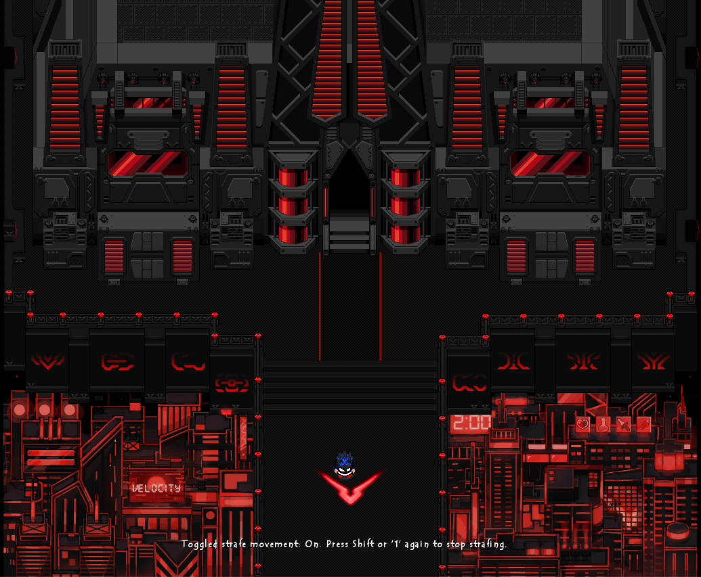
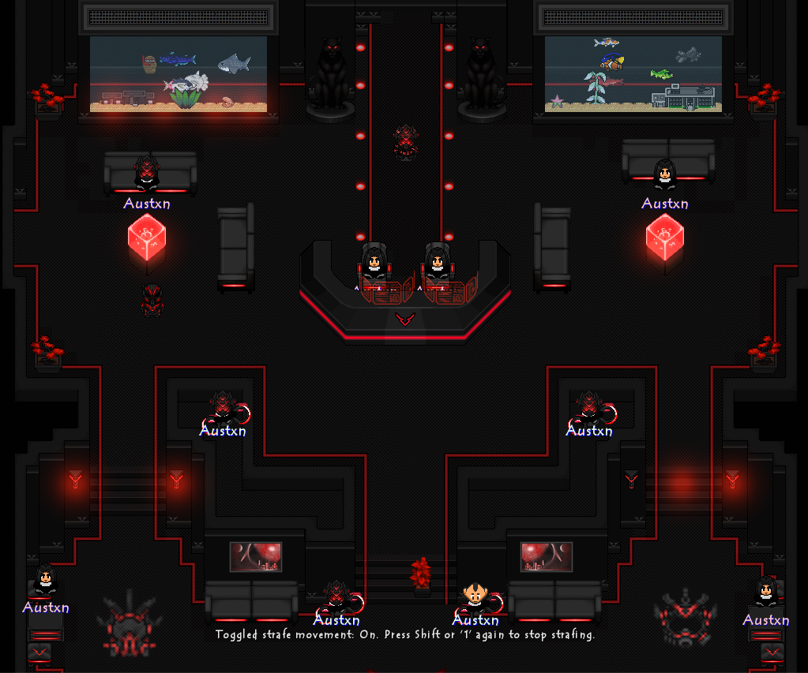
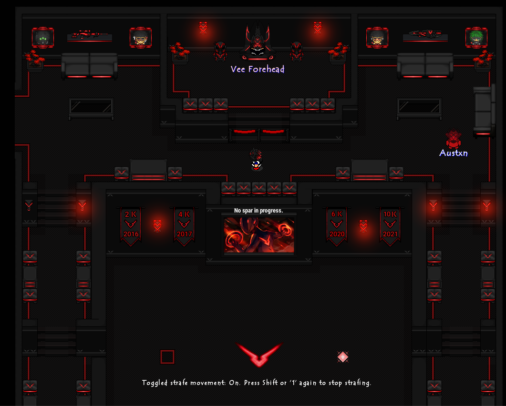
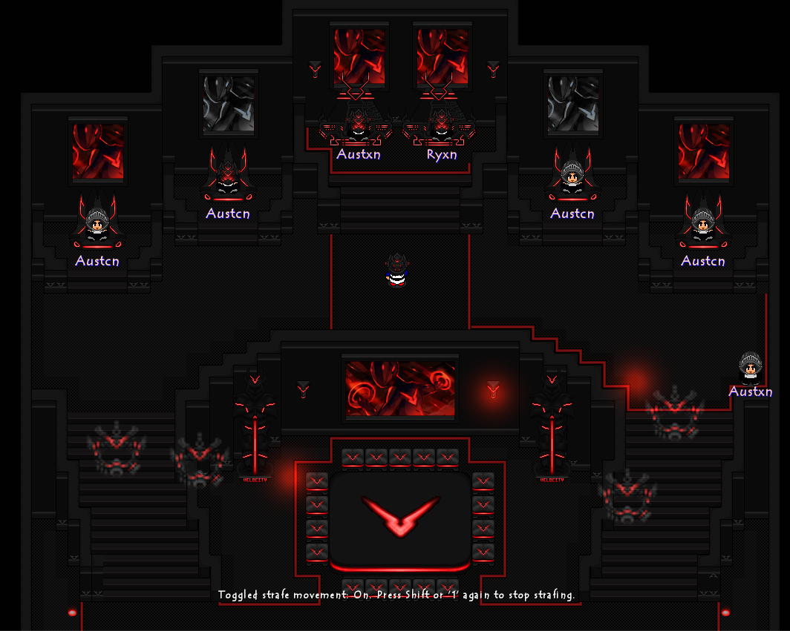
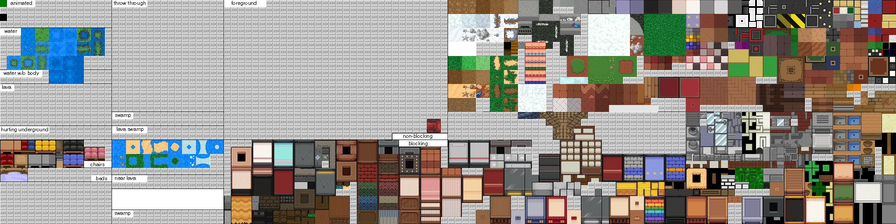

# Graal Online Era Levels
Brief overview of my personal work for GraalOnline

## In this repo

- **`/screenshots`** — In-engine captures of finished level areas (hideout entrance, lobby, sparring room, throne room).
- **`/scripts`** — Sample GScript source from the levels' interactive systems.

## Featured system: dynamic wall fading

One recurring technical challenge across these levels was letting players see into interior rooms (thrones, lobbies, sparring areas) without breaking the exterior architecture. I built a **proximity-based wall fade system** in GScript: wall segments detect the player's position each tick and fade in or out depending on whether the player has walked into a defined trigger zone.

Three variants were needed depending on wall placement and desired behavior:
- [`wall_fade_white.gs`](scripts/wall_fade_white.gs) — standard fade-in-on-approach behavior for interior-facing walls
- [`wall_fade_city.gs`](scripts/wall_fade_city.gs) — inverted trigger logic for exterior-facing walls
- [`wall_fade_black.gs`](scripts/wall_fade_black.gs) — per-segment bounding-box detection instead of a fixed zone, used for interior partitions, with draw-order handling (`drawunderplayer()`) so the player renders correctly against the fading wall

## Level screenshots

### Hideout Entrance

### Hideout Lobby

### Sparring Room

### Throne Room

### Throne Room (with custom art)

## Tile work

Custom and curated tileset used across the 2020-era levels, organized by category (terrain, water, furniture, blocking/non-blocking objects, animated tiles):

