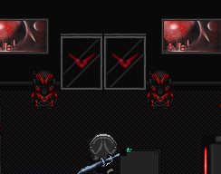
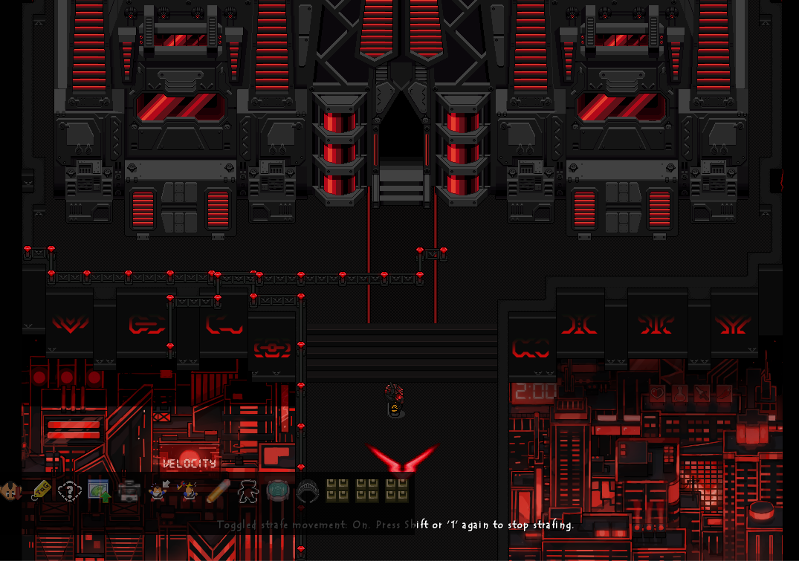
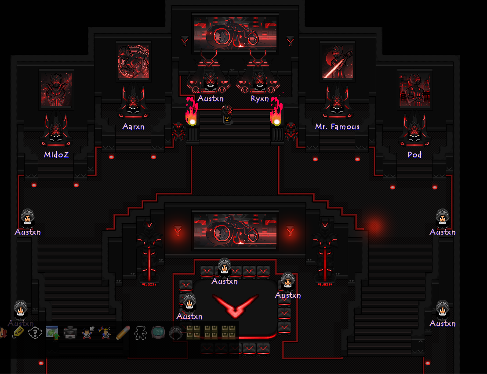

# Graal Online Era Levels

Brief overview of my personal work for GraalOnline

## In this repo
- **`/screenshots`** — In-engine captures of finished level areas (hideout entrance, lobby, sparring room, throne room).
- **`/scripts`** — Sample GS2 (GraalScript 2) source from the levels' interactive systems.

## Featured system: dynamic wall fading

One recurring technical challenge across these levels was letting players see into interior rooms (thrones, lobbies, sparring areas) without breaking the exterior architecture. I built a **proximity-based wall fade system** in GS2: wall segments detect the player's position each tick and fade in or out depending on whether the player has walked into a defined trigger zone.

Three variants were needed depending on wall placement and desired behavior:
- [`wall_fade_white.txt`](scripts/wall_fade_white.txt) — standard fade-in-on-approach behavior for interior-facing walls
- [`wall_fade_city.txt`](scripts/wall_fade_city.txt) — inverted trigger logic for exterior-facing walls
- [`wall_fade_black.txt`](scripts/wall_fade_black.txt) — per-segment bounding-box detection instead of a fixed zone, used for interior partitions and standalone objects, with draw-order handling (`drawunderplayer()`) so the player renders correctly against the fading wall

**Demo:** [Hideout_Balcony_Fade.mov](https://github.com/davpqb/GraalOnline-Era-Levels/blob/main/screenshots/Hideout_Balcony_Fade.mov) shows the `wall_fade_black.txt` logic in action — the balcony fades out based on the player's proximity to it as they walk underneath, rather than a fixed room-zone split.

## A small challenge

Not every effect in these levels has its script preserved. Here's a gif showing a set of double doors sliding open on player interaction — the script behind it wasn't kept, but the mechanism is a fun one to reason through. 

## Level screenshots

### Entrance

### Lobby

### Sparring Room

### Throne Room (with custom art)

## Tile work

Custom and curated tileset used across the 2020-era levels, organized by category (terrain, water, furniture, blocking/non-blocking objects, animated tiles):

